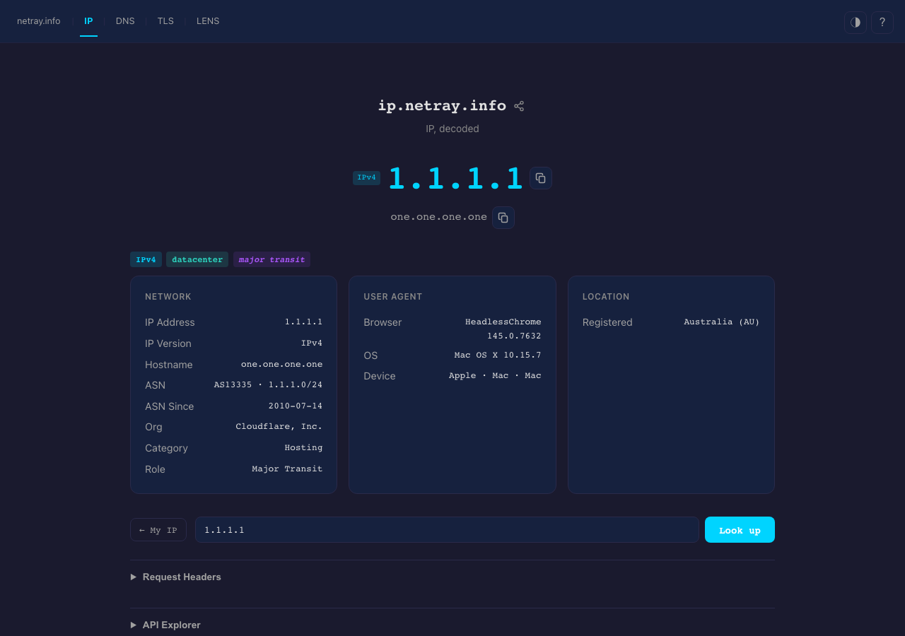
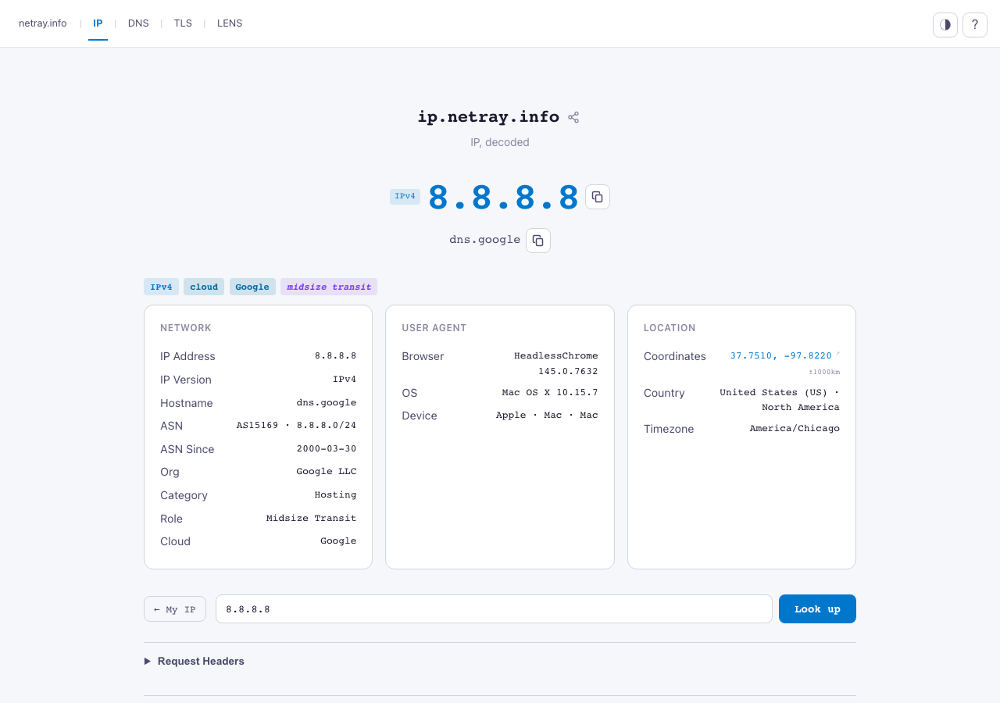
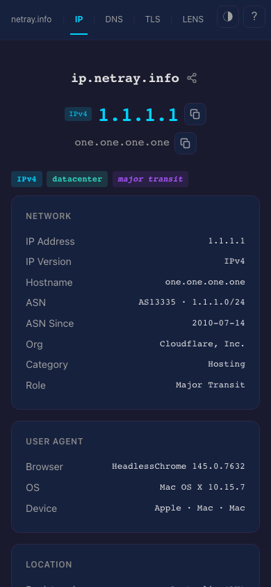

<div align="center">

# **ifconfig-rs** — IP, decoded

**Your IP. Any IP. Plain text for scripts, rich data for humans.**

[](https://ip.netray.info)
[](https://ip.netray.info/docs)
[](https://github.com/lukaspustina/ifconfig-rs/actions/workflows/ci.yml)
[](CHANGELOG.md)
[](LICENSE)

<br>

```sh
$ curl ip.netray.info
203.0.113.42
```

*That's it. One command. No noise.*

<br>



<br>

</div>

---

## What it does

Drop-in replacement for `ifconfig.co` and friends — but with actual network intelligence. Beyond returning your IP, ifconfig-rs classifies every address across six detection layers:

- **Cloud provider** — AWS, GCP, Azure, Cloudflare, Oracle, DigitalOcean, and more — including service and region
- **VPN detection** — named VPN providers by ASN + CIDR cross-reference
- **Tor exit nodes** — live list from the Tor Project
- **Bot classification** — Googlebot, Bingbot, and other crawler ranges
- **Threat intelligence** — Feodo Tracker C2 botnet nodes, Spamhaus DROP/EDROP hijacked netblocks
- **Geolocation** — city, region, country, coordinates, timezone, accuracy radius

Content negotiation is automatic: `curl` gets plain text, browsers get the full SPA, API clients get JSON.

---

## Screenshots

*Inspecting [1.1.1.1](https://ip.netray.info/?ip=1.1.1.1) and [8.8.8.8](https://ip.netray.info/?ip=8.8.8.8) — cloud provider and network role detected.*

<table>
<tr>
<td width="50%">

**Dark theme — Cloudflare DNS (1.1.1.1)**


</td>
<td width="50%">

**Light theme — Google DNS (8.8.8.8)**



</td>
</tr>
<tr>
<td width="50%">

**Mobile**



</td>
<td width="50%">

**Interactive API docs**


</td>
</tr>
</table>

---

## Try it

```sh
# Your public IP
curl ip.netray.info

# Specific IP — enrichment + classification
curl ip.netray.info/?ip=1.1.1.1

# Just the IP, nothing else
curl ip.netray.info/ip

# Full enrichment as JSON
curl ip.netray.info/json

# Specific fields only
curl 'ip.netray.info/json?fields=ip,location,network'

# Batch lookup — up to 100 IPs at once
curl -X POST ip.netray.info/batch \
  -H 'Content-Type: application/json' \
  -d '["1.1.1.1","8.8.8.8","9.9.9.9"]'
```

**Shareable link:** `https://ip.netray.info/?ip=8.8.8.8`

---

## API Reference

### Endpoints

| Endpoint | Returns |
|---|---|
| `GET /` | Full enrichment (auto-negotiated format) |
| `GET /ip` | IP address only |
| `GET /ip/cidr` | IP in CIDR notation (`/32` or `/128`) |
| `GET /ipv4` | IPv4 address only |
| `GET /ipv6` | IPv6 address only |
| `GET /location` | Geolocation (city, country, coordinates, timezone) |
| `GET /isp` | ASN and organisation |
| `GET /network` | Network classification (cloud/VPN/Tor/bot/threat flags) |
| `GET /host` | Reverse DNS hostname |
| `GET /tcp` | Source TCP port |
| `GET /user_agent` | Parsed browser/OS/device |
| `GET /headers` | Raw request headers |
| `GET /all` | All fields |
| `GET /asn/{number}` | ASN lookup by number |
| `GET /range?cidr=<prefix>` | CIDR classification |
| `POST /batch` | Bulk IP enrichment (JSON array, up to 100) |
| `POST /diff` | Side-by-side comparison of two IPs |
| `GET /meta` | Site metadata (JSON) |
| `GET /health` | Liveness probe |
| `GET /ready` | Readiness probe (GeoIP loaded?) |
| `GET /api-docs/openapi.json` | OpenAPI 3.1 spec |
| `GET /docs` | Interactive API docs (Scalar UI) |

### Output formats

Every endpoint supports multiple formats — choose by path suffix, query parameter, or `Accept` header:

```sh
curl ip.netray.info/json          # JSON
curl ip.netray.info/yaml          # YAML
curl ip.netray.info/toml          # TOML
curl ip.netray.info/csv           # CSV

curl 'ip.netray.info/?format=json'           # query param
curl -H 'Accept: application/json' ip.netray.info  # Accept header
```

**Content negotiation priority:** format suffix → `?format=` → CLI detection (curl/wget/httpie) → `Accept` header → HTML SPA.

### Query parameters

| Parameter | Description |
|---|---|
| `?ip=<addr>` | Look up any global IP instead of the caller's |
| `?fields=<f1>,<f2>` | Return only specified top-level fields |
| `?dns=false` | Skip reverse DNS lookup |
| `?lang=<BCP-47>` | Locale-aware city/country names (e.g. `?lang=de`) |

### JSON response shape

```json
{
  "ip":       { "addr": "1.1.1.1", "version": "4" },
  "host":     { "name": "one.one.one.one" },
  "tcp":      { "port": 54321 },
  "location": { "city": "Sydney", "country": "Australia", "country_iso": "AU",
                "latitude": -33.86, "longitude": 151.2, "timezone": "Australia/Sydney",
                "continent": "Oceania", "is_eu": false, "accuracy_radius_km": 100 },
  "isp":      { "asn": 13335, "name": "Cloudflare, Inc." },
  "network":  {
    "type": "cloud", "infra_type": "cloud",
    "is_datacenter": true, "is_vpn": false, "is_tor": false,
    "is_bot": false, "is_c2": false, "is_spamhaus": false,
    "cloud": { "provider": "Cloudflare", "service": null, "region": null },
    "asn_category": "hosting", "network_role": "major_transit"
  },
  "user_agent": { "browser": { "family": "curl", "version": "8.6.0" }, ... }
}
```

### Threat intelligence fields

| Field | Source | Meaning |
|---|---|---|
| `is_c2` | Feodo Tracker | Active botnet C2 node — block immediately |
| `is_spamhaus` | Spamhaus DROP/EDROP | Hijacked netblock — whole-prefix filtering |
| `is_tor` | Tor Project bulk list | Tor exit node |
| `is_bot` | Publisher IP lists | Crawler (Googlebot, Bingbot, etc.) |

### CI / Pipeline integration

```sh
# What's our server's public IP?
PUBLIC_IP=$(curl -s ip.netray.info)

# Is this IP flagged as a threat?
curl -s "ip.netray.info/json?ip=$IP" | jq '.network | {type, is_c2, is_spamhaus, is_tor}'

# Batch-enrich a list of IPs from a file
jq -Rn '[inputs]' ips.txt | curl -s -X POST ip.netray.info/batch \
  -H 'Content-Type: application/json' -d @- | jq '.[] | {ip: .ip.addr, type: .network.type}'
```

---

## Self-Hosting

### Docker (quickest)

```sh
docker run -p 8080:8080 \
  -v $(pwd)/data:/data \
  -v $(pwd)/ifconfig.toml:/etc/ifconfig.toml \
  ghcr.io/lukaspustina/ifconfig-rs
```

### From source

```sh
git clone https://github.com/lukaspustina/ifconfig-rs
cd ifconfig-rs
make            # frontend + release binary
./target/release/ifconfig-rs ifconfig.example.toml
```

---

## Configuration

Copy `ifconfig.example.toml` and adjust:

```toml
base_url = "ip.example.com"
geoip_city_db = "data/GeoLite2-City.mmdb"
geoip_asn_db  = "data/GeoLite2-ASN.mmdb"
user_agent_regexes = "data/regexes.yaml"

# Optional threat intelligence feeds
tor_exit_nodes       = "data/tor_exit_nodes.txt"
cloud_provider_ranges = "data/cloud_provider_ranges.jsonl"
feodo_botnet_ips     = "data/feodo_botnet_ips.txt"
vpn_ranges           = "data/vpn_ranges.txt"
spamhaus_drop        = "data/spamhaus_drop.txt"

[server]
bind = "0.0.0.0:8080"
# trusted_proxies = ["10.0.0.0/8"]

[rate_limit]
per_ip_per_minute = 60
per_ip_burst = 10

[batch]
enabled = true
max_size = 100

[cache]
enabled = true
ttl_secs = 300
```

Override any value with `IFCONFIG_` env vars (`__` for nested sections): `IFCONFIG_SERVER__BIND=0.0.0.0:8080`.

Data files live in `data/`. Acquire them with `make -C data get_all` (requires a free MaxMind license for GeoLite2).

---

## Building

Prerequisites: Rust toolchain, Node.js (for the frontend).

```sh
make            # frontend + release binary
make dev        # cargo run with ifconfig.dev.toml (port 8080)
make test       # unit + integration tests (~300 tests)
make ci         # full gate: fmt, clippy, test, frontend, audit
```

---

## Tech stack

**Backend** — Rust · Axum 0.8 · tokio · tower · utoipa (OpenAPI 3.1) · MaxMind GeoLite2 · rust-embed

**Frontend** — SolidJS 1.9 · Vite · TypeScript (strict)

**Part of** — [netray.info](https://netray.info) suite: [DNS](https://dns.netray.info) · [TLS](https://tls.netray.info) · [HTTP](https://http.netray.info) · [Email](https://email.netray.info) · [Lens](https://lens.netray.info)

---

## License

MIT — see [LICENSE](LICENSE).
